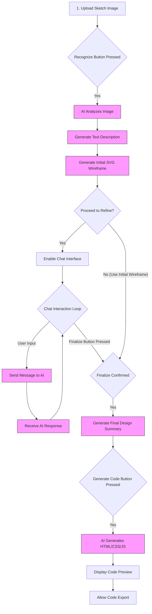

# ✨ Wirerio: From Sketch to Site ✨

**Unleash your inner designer! Transform your hand-drawn UI sketches into functional web code with the magic of AI.**

Welcome to Wirerio, where your creative sparks meet intelligent code generation. Inspired by an elegant beige and brown palette and sophisticated typography ('Playfair Display' for headings, 'Inter' for clarity), Wirerio offers a seamless, intuitive workflow to bring your website visions to life, directly from your notebook to the browser.

---

## 🚀 Elevator Pitch

Ever sketched a brilliant website idea on a napkin? Wirerio is your AI-powered assistant that understands those sketches. Upload an image, and watch as Wirerio:

1.  **Analyzes** the layout and elements using advanced AI vision.
2.  **Generates** an initial interactive wireframe (as an SVG).
3.  **Collaborates** with you via chat to refine the design iteratively.
4.  **Writes** the HTML, CSS, and JavaScript code for your finalized design.

It's rapid prototyping reimagined, making web creation more accessible and accelerating the journey from concept to clickable reality.

---

## 🏗️ Architecture & Flow

Here's a look at the system architecture and user workflow:

**User Workflow:**



---

## 🌟 Key Features

* **🖼️ AI Sketch Analysis:** Upload JPG, PNG, etc. Wirerio's AI identifies UI elements (buttons, inputs, images, text areas) and understands the layout structure.
* **📐 Automated Wireframing:** Get an instant SVG wireframe suggestion based on the sketch analysis.
* **💬 Conversational Refinement:** Chat directly with the AI to tweak the wireframe. "Make the header smaller," "Add a contact form," "Change the sidebar position" – it understands!
* **💻 Code Generation:** Generate a complete, single `index.html` file containing semantic HTML, embedded CSS (following the site's theme!), and basic JavaScript placeholders.
* **🎨 Themed UI:** A beautiful, responsive interface designed with a warm, elegant beige/brown palette (`#c0a062`, `#fdfaf5`, `#4a3c2a`, `#6b5a44`) and refined fonts (`Inter`, `Playfair Display`).
* **🚀 Rapid Prototyping:** Go from idea to a coded prototype faster than ever.

---

## ⚙️ How It Works (The Magic Steps)

1.  **Capture:** Drag & drop or select your sketch image. See a preview instantly.
2.  **Analyze & Visualize:** Click "Analyze Sketch". The AI describes the elements and generates an initial SVG wireframe.
3.  **Refine:** Proceed to the chat interface. Discuss changes with the AI assistant until the design feels right.
4.  **Generate:** Finalize the design. Click "Generate HTML/CSS/JS" to get the complete code, ready to preview and export.

---

## 🛠️ Tech Stack

* **Frontend:** Plain HTML5, CSS3, JavaScript (ES Modules)
* **AI:** Google Generative AI SDK for JavaScript (`@google/generative-ai`)
    * Model: `gemini-2.0-flash` (as per the code)
* **Styling:** Vanilla CSS with CSS Variables (no frameworks)
* **Fonts:** Google Fonts (`Inter`, `Playfair Display`)
* **Diagrams:** Mermaid.js syntax

---

## 🔌 Setup & Running Locally

1.  **Clone the Repository:**
    ```bash
    git clone [https://github.com/Eeman1113/Wirerio.git](https://www.google.com/search?q=https://github.com/Eeman1113/Wirerio.git)
    cd Wirerio
    ```
2.  **Get a Google Generative AI API Key:**
    * Visit the [Google AI Studio](https://aistudio.google.com/) or [Google Cloud Console](https://console.cloud.google.com/) to obtain an API key.
3.  **Open in Browser:**
    * You can often open the `index.html` file directly in your web browser (`file:///...`).
    * For full functionality (especially ES Modules), it's better to use a simple local web server:
        * If you have Python: `python -m http.server 8000` (or `python3 -m http.server 8000`)
        * If you have Node.js and `http-server`: `npx http-server .`
    * Then navigate to `http://localhost:8000` (or the port used).

---

## 📜 Technical Report

### Project Goals

* To create a web application that leverages generative AI to convert hand-drawn UI sketches into initial wireframes and then into basic frontend code (HTML/CSS/JS).
* To provide an intuitive, multi-step user interface guiding the user through the process.
* To explore the capabilities of multi-modal AI (image input) and conversational AI for design refinement.
* To offer a rapid prototyping tool accessible to users with varying technical skills.

### Architecture

* **Client-Side Application:** Wirerio is currently implemented entirely as a client-side application running in the user's browser. (See Architecture Diagram above).
* **Core Components (JavaScript):**
    * **UI Management:** Functions to handle showing/hiding steps, updating output areas (description, wireframe, code), managing button states, and resetting the UI (`showStep`, `hideStep`, `resetWorkflowSteps`, etc.).
    * **File Handling:** Drag & drop functionality, file input handling, preview generation (`handleFiles`, `handleDrop`).
    * **AI Interaction Module:**
        * Initialization of `GoogleGenerativeAI` with the API key.
        * `fileToGenerativePart`: Converts the uploaded image file into the base64 format required by the Gemini API.
        * API Call Wrappers: Functions making requests to the Gemini model for:
            * Sketch Analysis (Image + Text Prompt -> Text Description)
            * Wireframe Generation (Text Description -> SVG String) - Uses `model.generateContent`.
            * Chat Refinement (Chat History + Text Prompt -> Text Response) - Uses `model.startChat` and `chat.sendMessage`.
            * Code Generation (Text Summary/Description -> HTML/CSS/JS String) - Uses `model.generateContent`.
    * **State Management:** Simple state variables (`uploadedFile`, `sketchDescription`, `chatHistory`, `wireframeData`, `generatedCode`) to hold data between steps.
* **AI Model:** Google Gemini (`gemini-2.0-flash` specified). Relies on its multi-modal capabilities (understanding images) and text generation strengths for description, SVG, chat, and code.
* **Security Model (Current Weakness):** The Google AI API key is stored directly in the frontend JavaScript code, posing a significant security risk if deployed publicly. A backend proxy architecture is recommended.

### AI Integration Details

* **SDK:** `@google/generative-ai` for JavaScript.
* **Model Invocation:**
    * `genAI.getGenerativeModel({ model: MODEL_NAME })`
    * `model.generateContent({ contents: [...], generationConfig, safetySettings })` for single-turn tasks (analysis, wireframe, code).
    * `model.startChat({ history: [...], generationConfig, safetySettings })` and `chat.sendMessage(userMessage)` for multi-turn chat refinement.
* **Input Formatting:** Images are converted to `inlineData` (base64) using `fileToGenerativePart`. Text prompts are constructed dynamically based on the current step and available context (e.g., sketch description, chat history).
* **Prompt Engineering:** Specific prompts are crafted for each AI task:
    * *Analysis:* "Analyze this hand-drawn UI sketch in detail..."
    * *Wireframe:* "Based on this UI description, create a simple wireframe SVG diagram... Respond ONLY with the valid SVG code block..." (Includes specific instructions for layout and style).
    * *Chat:* Uses conversation history, implicitly guided by the context. A system message sets the initial role.
    * *Code Gen:* A detailed prompt specifying output format (single HTML file), structure (semantic HTML, embedded CSS/JS), styling requirements (theme colors, fonts), responsiveness, and reliance on the final design summary.
* **Configuration:**
    * `generationConfig`: Controls creativity and output length (`temperature`, `topK`, `topP`, `maxOutputTokens` - note higher token limit for code).
    * `safetySettings`: Configured to block harmful content above a medium threshold (`BLOCK_MEDIUM_AND_ABOVE`).
* **Output Handling:** Responses (`response.text()`) are parsed. Specific logic attempts to extract SVG code using regex (`/<svg[\s\S]*?<\/svg>/`) and cleans up potential markdown fences from code output. Error handling checks for blocked responses or empty content.

### Key Challenges & Solutions

1.  **API Key Security:**
    * *Challenge:* Embedding the API key client-side is insecure.
    * *Current State:* Key is exposed.
    * *Recommended Solution:* Implement a backend proxy server.
2.  **Reliable SVG Generation:**
    * *Challenge:* Ensuring the AI consistently outputs valid, well-structured SVG according to prompt constraints.
    * *Solution:* Detailed prompt engineering with explicit instructions (viewBox, basic shapes, grayscale, positioning, response format), regex extraction, and basic cleanup/validation (`width="100%"` addition). Still requires robust error handling.
3.  **Consistent Code Generation:**
    * *Challenge:* Getting the AI to generate code that accurately reflects the refined design, adheres to formatting rules (single file, embedded styles/scripts), and uses the correct theme.
    * *Solution:* A very detailed prompt providing context (description, summary, even the wireframe SVG as reference), explicit formatting requirements, and theme details. Using a lower temperature (`0.4`) in `codeGenerationConfig` aims for more predictable output.
4.  **Maintaining State:**
    * *Challenge:* Passing context (sketch description, chat history, final summary) between different steps/AI calls in a client-only app.
    * *Solution:* Using simple JavaScript variables (`sketchDescription`, `chatHistory`, etc.) to store state locally within the browser session. This is volatile and lost on refresh.
5.  **User Experience:**
    * *Challenge:* Providing clear feedback during AI processing (loading states), handling errors gracefully, and making the multi-step workflow intuitive.
    * *Solution:* UI helper functions manage step visibility/opacity, dedicated loading/error states for output areas, disabled button states during processing, and clear instructions/labels.

### Future Enhancements

* **Backend Implementation:** Refactor to use a secure backend proxy for API calls.
* **Improved State Management:** Use `localStorage` or `sessionStorage` for persistence across page reloads, or a more robust state management library if complexity increases.
* **Component Libraries:** Allow users to specify or select UI component libraries (e.g., Bootstrap, Tailwind CSS, Material UI) for code generation.
* **Framework Support:** Generate code for specific frontend frameworks (React, Vue, Svelte).
* **Advanced Wireframing:** Generate more detailed or interactive wireframes.
* **Version History:** Allow users to save and revert to previous design versions during refinement.
* **Real-time Collaboration:** (Ambitious) Allow multiple users to collaborate on refining a design.
* **Enhanced Error Handling:** More specific error messages and potential retries for AI calls.
* **Code Quality Options:** Allow users to configure code style preferences (e.g., indentation, CSS methodology).

---

## 🙌 Contributing

Contributions are welcome! If you have ideas for improvements or find bugs, please feel free to:

1.  Fork the repository: `https://github.com/Eeman1113/Wirerio`
2.  Create a new branch (`git checkout -b feature/YourAmazingFeature`).
3.  Make your changes.
4.  Commit your changes (`git commit -m 'Add some amazing feature'`).
5.  Push to the branch (`git push origin feature/YourAmazingFeature`).
6.  Open a Pull Request.

Please ensure your code adheres to basic quality standards and address the API key security issue if you plan to deploy publicly.

---

## 📄 License

This project is likely under the [MIT License](LICENSE) (or choose another appropriate license). Please add a LICENSE file.

---

<p align="center">
  <em>Crafted with ✨ by the Wirerio Team [Me Alone Lmao] (Concept)</em> <br>
  &copy; 2025 Wirerio Concept. All rights reserved.
</p>
